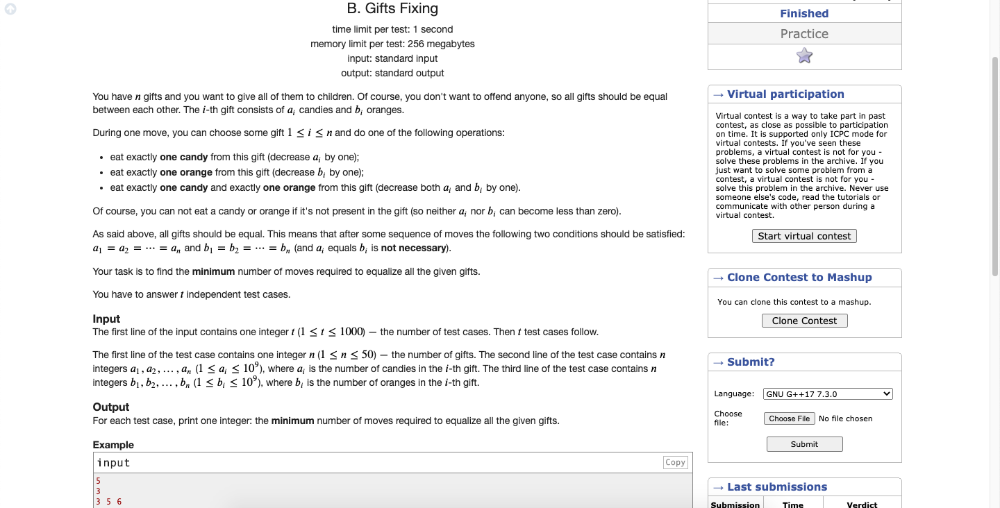

# Codeforces-1399B-Gifts-Fixing
### Problem

### Program Simulation
<pre>
  Sample Input:
  3 5 6 
  3 2 3
  
  mna=3
  mnb=2
  
  ans=0
  
  * First Loop *
  ans+=max(3-3, 3-2)
  ans+=1
  ans=1
  
  * Second Loop *
  ans+=max(5-3, 2-2)
  ans=+=2
  ans=3
  
  * Third Loop *
  ans+=max(6-3, 3-2)
  ans+=3
  ans=6
  
  print ans
  
  Final Output:
  6
  

  Sample Input:
  1 2 3 4 5
  5 4 3 2 1
  
  mna=1
  mnb=1
  
  ans=0
  
  * First Loop *
  ans+=max(1-1, 5-1)
  ans+=4
  ans=4
  
  * Second Loop *
  ans+=max(2-1, 4-1)
  ans+=3
  ans=7
  
  * Third Loop *
  ans+=max(3-1, 3-1)
  ans+=2
  ans=9
  
  * Fourth Loop *
  ans+=max(4-1, 2-1)
  ans+=3
  ans=12
  
  * Fifth Loop *
  ans+=max(5-1, 1-1)
  ans+=4
  ans=16
  
  print ans
  
  Final Output:
  16
  

  Sample Input:
  10 12 8
  7 5 4
  
  mna=8
  mnb=4
  
  ans=0
  
  * First Loop *
  ans+=max(10-8, 7-4)
  ans+=3
  ans=3
  
  * Second Loop *
  ans+=max(12-8, 5-4)
  ans+=4
  ans=7
  
  * Third Loop *
  ans+=max(8-8, 4-4)
  ans+=0
  ans=7
  
  print ans
  
  Final Output:
  7
</pre>
